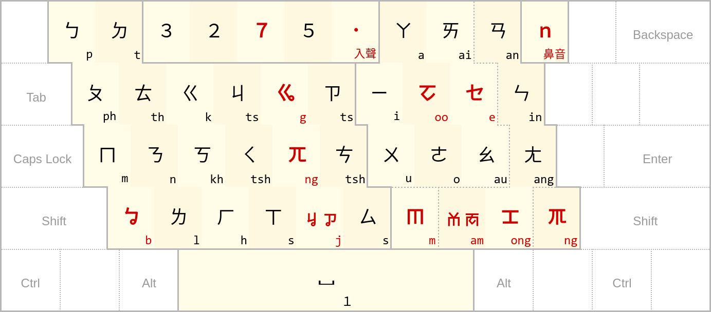

# Taigi-TPS 台語方音輸入法
> 配方： **℞ yuren-tw/rime-taigi-tps**

1. 本方案基於 RIME 輸入法引擎
2. 方案配置檔：`taigi_tps.schema.yaml`
3. 字典檔：（詳見[下方說明](#台語字典)）
    - `taigi_yu.dict.yaml`
    - `taigi_yu.han.dict.yaml`
    - `taigi_yu.tl.dict.yaml`（未完成）
    - `taigi_yu.poj.dict.yaml`（未完成）

## 鍵盤配置
本方案以大千式注音符號為基礎，修改成台語方音符號鍵盤，適合熟悉注音輸入法的使用者。
> [方音符號](https://zh.wikipedia.org/wiki/臺灣方音符號)是以[注音符號](https://zh.wikipedia.org/wiki/注音符號)為基礎來擴充的一種標音符號，主要用於標註台語。

（與大千式配置不同的符號在上圖以紅色粗體字表示）

| 配置差異   | <kbd>Z | <kbd>T | <kbd>G | <kbd>B | <kbd>I | <kbd>, | <kbd>O | <kbd>. | <kbd>M | <kbd>/ | <kbd>- | <kbd>5 | <kbd>7 |
|:---------:|:-:|:-:|:-:|:-:|:-:|:-:|:-:|:-:|:-:|:-:|:-:|:-:|:-:|
| **大千式** | ㄈ |  ㄔ  | ㄕ | ㄖ | ㄛ | ㄝ | ㄟ | ㄡ | ㄩ | ㄥ |  ㄦ  |  ㄓ  | 輕聲 |
| **本方案** | ㆠ | ㆢㆡ | ㄫ | ㆣ | ㆦ | ㆤ | ㆰ | ㆲ | ㆬ | ㆭ | 鼻音 | ７聲 | 入聲 |

鍵盤配置與方音符號詳細介紹請參考：[方音符號鍵盤](./theTPS.md)。

## 基本輸入方式
本方案採用台語方音符號來輸入，符號分為「聲母」、「韻母」、「聲調」，基本輸入順序與注音輸入法的「聲母 + 韻母 + 聲調」相同。詳細的拼音對照請參考[拼音對照表](./table.md)。

### 聲母
除了方音新增了華語沒有的**濁音**（`ㆠ`、`ㆡ`、`ㆢ`、`ㆣ`）與鼻音 `ㄫ`（「雅」的聲母）以外，其他符號發音與注音相同
> 其實注音 `ㄏ` 是發 /x/，但台灣人幾乎都發成方音 `ㄏ` 的 /h/ 音（我感覺啦）

- 方音區分 `ㄐ`、`ㄑ`、`ㄒ`、`ㆢ` 與 `ㄗ`、`ㄘ`、`ㄙ`、`ㆡ`，熟悉台羅、白話字的使用者請多注意
- 本方案中，`ㆢ` 與 `ㆡ` 合併在同一個鍵位

### 韻母
- **純母音**：`ㄧ`、`ㄨ`、`ㄚ`、`ㆦ`、`ㄜ`、`ㆤ`、`ㄞ`、`ㄠ`
  - `ㆦ` 與注音 `ㄛ` 相似，`ㆤ` 與注音 `ㄝ` 相似，分辨不出來是正常現象
- **ㆬ韻尾**：`ㆰ`、`ㆱ`
  - `ㆰ` 就是 `ㄚㆬ`（am），`ㆱ` 就是 `ㆦㆬ`（om）
  - `ㆱ` 較為罕見，**本方案中併入 `ㆰ`**
- **ㄣ韻尾**：`ㄢ`、`ㄣ`
  - `ㄣ` 只用在結合韻母 `ㄧㄣ`、`ㄨㄣ`、`ㆤㄣ`
- **ㆭ韻尾**：`ㄤ`、`ㄥ`、`ㆲ`
  - `ㆲ` 就是 `ㆦㆭ`（ong）
  - `ㄥ` 只用在結合韻母 `ㄧㄥ`，**本方案中併入 `ㆭ`**
- **韻化子音**：`ㆬ`、`ㆭ`
  - 單以子音形成韻母，符號就是 `ㄇ`、`ㄫ` 加上一豎
- 完整的韻母組合請參考[拼音對照表](./table.md)

### 聲調
台語主要有七個聲調，發音相似的聲調採用與注音相同的符號，鍵位設置也相同。
- 第１調與注音一聲相似、第２調與注音四聲相似、第５調與注音二聲相似
- 第３調相當於注音三聲的前半段，與第２調相似但較低音
    > 不過台灣人注音三聲幾乎也只發前半段
- 第７調與第１調相似但較低音
- 第４、８調為「入聲調」，發音短促且以子音韻尾收束
  - 方音以對應部位的聲母小寫標示（`ㆴ`、`ㆵ`、`ㆻ`、`ㆷ`）

標記方式如下，以 `ㄚ` 為例：

| 調號 | 1 | 2 | 3 | 4 | 5 | 7 | 8 |
|:----:|:-:|:-:|:-:|:-:|:-:|:-:|:-:|
| 符號 | ㄚ | ㄚˋ | ㄚ˪ | ㄚㆷ | ㄚˊ | ㄚ˫ | ㄚㆷ̇ |

## 功能
- 必要功能：[**鼻化韻母輸入**](#鼻化韻母輸入)、[**入聲調輸入**](#入聲調輸入)
- 輸入更貼近發音：[**變調輸入**](#變調輸入)、[**音變輸入**](#音變輸入)、[**方言差輸入**](#方言差輸入)
- 🔰 適合新手：[**結合韻母拆開輸入**](#結合韻母拆開輸入)、[**注音相似音輸入**](#注音相似音輸入)
- 其他功能：[**簡拼輸入**](#簡拼輸入)、**Yu-α 符號表**

### 鼻化韻母輸入
鼻化韻母的輸入方式為「韻母 + **鼻音鍵** `ｎ`」：例如以 `ㄚｎ` 來輸入 `ㆩ`

### 入聲調輸入
本方案輸入時不區分第４調與第８調，統一使用**入聲鍵** `．`。本方案提供兩種入聲調輸入方式：
- 韻母 + 入聲鍵 `．`：以韻母的韻尾決定入聲韻尾，與傳統韻書習慣相同，且按鍵數較少
  - 純母音：例如以 `ㄚ．` 來輸入 `ㄚㆷ`
  - ㆬ韻尾：例如以 `ㆰ．` 來輸入 `ㄚㆴ`
  - ㄣ韻尾：例如以 `ㄢ．` 來輸入 `ㄚㆵ`
  - ㆭ韻尾：例如以 `ㄤ．` 來輸入 `ㄚㆻ`
  - `ㆬ`、`ㆭ`：例如以 `ㆬ．` 來輸入 `ㆬㆷ`
  - 韻母與入聲韻的對應關係詳見[拼音對照表](./table.md)
- 🔰對應聲母 + 入聲鍵 `．`：**只適用於 `ㆴ`、`ㆵ`、`ㆻ`**
  - 例如以 `ㄚㄅ．` 來輸入 `ㄚㆴ`
  - 例如以 `ㄚㄉ．` 來輸入 `ㄚㆵ`
  - 例如以 `ㄚㄍ．` 來輸入 `ㄚㆻ`

### 變調輸入
台語有連續變調的特色，也就是一個字會因為與其他字組合成詞而改變聲調。基本上一個詞除了最後一字維持本調以外，其他字都會按照一定的規則變調。考量到使用者不一定能馬上逆推回本調，為了方便輸入，本方案提供使用者直接輸入變調後的聲調。
- １變７：例如以 `ㄏㄨㆤ˫ㄑㄧㄚˉ` 來輸入 `ㄏㄨㆤˉㄑㄧㄚˉ`（花車）
- ２變１：例如以 `ㄏㄨㆤˉㄑㄧㄚˉ` 來輸入 `ㄏㄨㆤˋㄑㄧㄚˉ`（火車）
- ３變２：例如以 `ㄏㄨㆤˋㄑㄧㄚˉ` 來輸入 `ㄏㄨㆤ˪ㄑㄧㄚˉ`（貨車）
- ７變３：例如以 `ㄗㆤ˪ㄨㄧ˫` 來輸入 `ㄗㆤ˫ㄨㄧ˫`（坐位）
- ５變３：例如以 `ㄊㄞ˪ㄅㄚㆻ` 來輸入 `ㄊㄞˊㄅㄚㆻ`（台北）
- ５變７：例如以 `ㄊㄞ˫ㄌㆰˊ` 來輸入 `ㄊㄞˊㄌㆰˊ`（台南）
- ４變２：例如以 `ㆠㄚˋㄨㄢˊ` 來輸入 `ㆠㄚㆷㄨㄢˊ`（肉圓）
- ８變３：例如以 `ㄐㄧㄚ˪ㄅㄚˋ` 來輸入 `ㄐㄧㄚㆷ̇ㄅㄚˋ`（食飽）

> 因為技術限制，缺乏跨字詞之間的處理，所以不太能做出細膩的變調

### 音變輸入
- 以 `ㄌ` 來輸入 `ㆢ`、`ㆡ`
- 以 `ㆣ` 來輸入 `ㆢ`
- 以 `ㆤㄣ`（en）來輸入 `ㄧㄢ`（ien、ian）
- 以 `ㆤㆵ`（et）、`ㄧㆤㆵ`（iet）來輸入 `ㄧㄚㆵ`（iat）

### 方言差輸入
輸入與優勢腔不同的發音
- 以 `ㆪ` 來輸入 `ㆥ`
  - 例如以 `ㄍㆪˉ` 來輸入 `ㄍㆥˉ`（更）
  - 例如以 `ㄇㄧˉ` 來輸入 `ㄇㆤˉ`（暝）
  - 例如以 `ㄑㆪˉ` 來輸入 `ㄘㆥˉ`（星）

> 其他輸入方式正在開發中。

### 🔰結合韻母拆開輸入
方音特有的結合韻母能拆開輸入
- `ㆰ`：以 `ㆰ` 或 `ㄚㆬ` 來輸入
- `ㆱ`：較為罕見，以 `ㆦㆬ` 或 `ㆰ` 來輸入
- `ㆲ`：以 `ㆲ` 或 `ㆦㆭ` 來輸入

### 🔰注音相似音輸入
下列拼音能用注音符號中發音相似的鍵位組合來輸入
- 以 `ㄨㆭ`（注音 `ㄨㄥ` /ʊŋ/）來輸入 `ㆲ` /ɔŋ/
- 以 `ㆬㆭ`（注音 `ㄩㄥ` /iʊŋ/）來輸入 `ㄧㆲ` /iɔŋ/

> 台語存在 `ㄅㆭ`（例如：飯）與 `ㄅㆲ`（例如：磅）的差別，此處不提供相似音輸入（注音 `ㄅㄥ`）以避免歧義

### 簡拼輸入
此方法**不適合**輸入單字
- 以鼻音鍵 `ｎ` 代表所有鼻化韻母
- 以入聲鍵 `．` 代表所有「韻母 + 入聲」
- 只輸入聲母
- 不輸入聲調（入聲不適用）
- 只輸入聲母 + 聲調

## 台語字典
本方案字典檔採用的字詞來源為[教育部臺灣閩南語常用詞辭典](https://twblg.dict.edu.tw/)（[資料檔 @ GitHub](https://github.com/g0v/moedict-data-twblg)）。

> 為了方便輸入法方案設計，字典採用特製的拼音（詳見[拼音對照表](./table.md)），大小寫有特殊意義。如有增修字典的需求請多注意。

### 字典檔
- `taigi_yu.dict.yaml`：總字典，包含方音符號輸入，需要搭配其他字典檔
- `taigi_yu.han.dict.yaml`：漢字詞典
- `taigi_yu.tl.dict.yaml`：台羅拼音詞典（暫定）
- `taigi_yu.poj.dict.yaml`：白話字詞典（暫定）

## 未來方向
### 第九調合音詞
- 例如 tsa̋ng 是 tsa-hng 的合音詞（昨昏）
- 將第九調與第五調（`ˊ`）合併
- 添加合音詞字典

### 其他腔調特殊音
- 例如 `ㆨ`（ir）、`ㄝ`（ee）、`ㄜㆤ`（ere）
- 改變字典拼音：使某些拼音能對應多種輸入，解法一
- 擴充字典：為特殊腔調另外製作字典，解法二

> 不過據說最後產生的結果都一樣啦 :/

